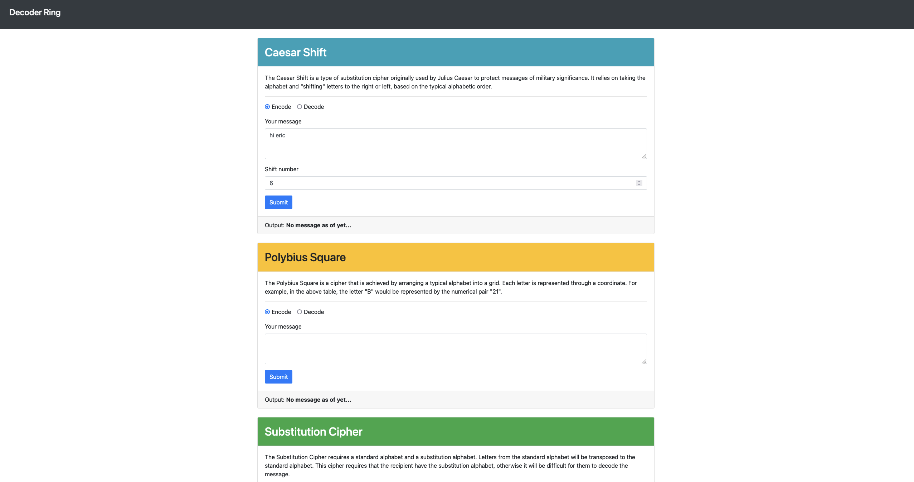

# upgraded-meme
Decoder ring THINKFUL Project
### You are planning a surprise birthday party for one of your friends who loves escape rooms and puzzles. What better way to practice your new coding skills than to build an application that will help you encode and decode all kinds of fun messages?

**This project is designed to test your ability to build tricky algorithms as well as write unit tests with Mocha and Chai. Before taking on this module, you should be comfortable with the following:**

- installing packages via NPM
- Modifying the package.json file with new scripts
- Running tests from the command line
- Writing JavaScript functions
- Writing tests for specific functions
- Iterating through strings, objects, and arrays
- Debugging through reading errors and using the VSCode debugge
